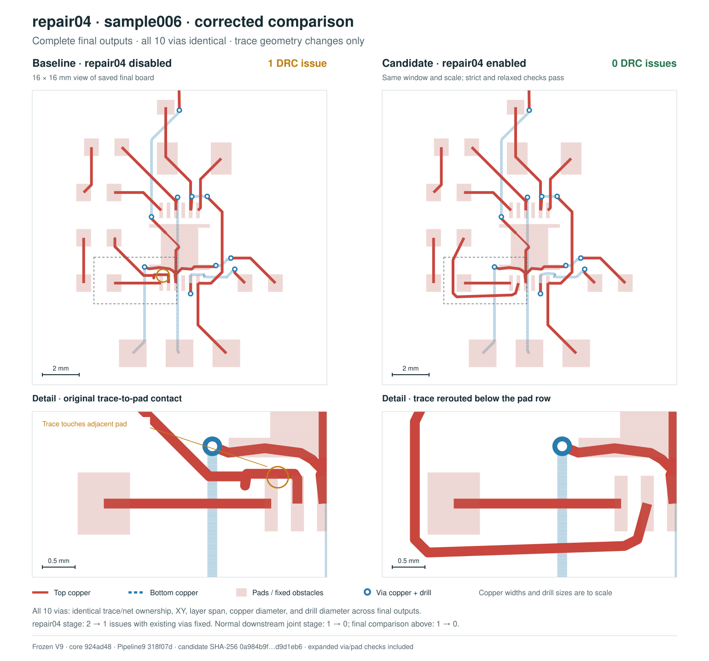

# repair04

> **Benchmark correction:** the original wrapper omitted dedicated via-in-pad and via-to-pad checks. Its reported passing-board totals are withdrawn. The sample006 repair is corrected; the complete dataset is being rerun with both checks. PR #2420 remains in draft.

A bounded, incremental DRC repair solver for routed Simple Route JSON. By default it searches for same-layer clearance paths, adjusts bends, replaces short polyline spans, and adds doglegs while preserving every existing via, region boundary, terminal, and required electrical junction. Via movement and local layer bridges require `allowLayerChanges: true`; new or moved vias must clear pads even on the same net.

```sh
bun add github:tscircuit/repair04
```

```ts
import {
  extractRepairRegion,
  mergeRepairRegion,
  Repair04Solver,
} from "@tscircuit/repair04"

const region = extractRepairRegion({
  srj,
  routes,
  bounds: { minX: -5, minY: -5, maxX: 5, maxY: 5 },
})
const { bounds, boundaryMargin, lockedPointIndices } = region
const solver = new Repair04Solver({
  srj: region.srj,
  routes: region.routes,
  bounds,
  boundaryMargin,
  lockedPointIndices,
  maxCandidates: 8000,
})
solver.solve()
const candidate = mergeRepairRegion({
  routes,
  region,
  repairedRoutes: solver.getOutput(),
})
// Accept candidate only after evaluating it with the caller's full-board DRC.
```

## Region contract

- Bounds must be finite and at least 10 × 10 mm. The caller can choose larger bounds around difficult defects.
- Extraction clips traversing traces at exact intersections and loads a fixed clearance halo. The collar grows with copper dimensions and required clearances.
- Original endpoints, port points, tee contacts, shared vias, boundary segments, and atomic through-obstacle spans are fixed. The merge validates both geometry and metadata and rejects stale source state.
- Fixed preloaded copper, relevant pads and keepouts, and local board edges remain in the regional context. Unrelated geometry and embedded full-board state are excluded.
- `Repair04Solver` takes only the serializable local problem. The caller retains source provenance and the enclosing board. Use extraction to provide fixed cut points where traces cross the mutable boundary.
- New bends retain copper width. Existing vias keep their exact positions, layer transitions, and diameters by default. With `allowLayerChanges: true`, vias move as complete layer transitions and new/moved vias must clear every pad. Variable-width spans are not simplified into narrower copper.

A step evaluates at most one candidate. `maxCandidates` gives a deterministic search budget. Clearance paths use a bounded 0.1 mm grid, refined to half the copper width for traces at most 0.1 mm wide, with at most 30,000 expanded states per path. With explicit `allowLayerChanges: true`, they can change layers using the existing via diameter after a bounded trace-only search. `solved` means that the optimization finished; unresolved DRC is reported by `stats.finalErrorCount`. Invalid geometry throws. `getOutput()` is available only after a completed solve and returns a copy.

The local score combines repair03's indexed copper checks with generic and rotated obstacle checks. Wire vertices on both sides of each via are explicit, so neither via-adjacent trace segment disappears from the score. A caller must still validate the merged board with its independent DRC implementation. Pipeline9 performs that check before accepting a region.

The corrected sample006 comparison uses complete final Pipeline9 outputs: the disabled baseline has **1 DRC issue**, and the enabled candidate has **0** under both default and relaxed checks, including via-in-pad and via-to-pad checks. All **10 vias are exactly identical** between final outputs, including trace/net ownership, positions, layer spans, copper diameters, and drill diameters; only two traces change geometry. Within the pipeline, repair04 reduces the issue count from 2 to 1 while preserving every existing via, and the normal downstream joint stage resolves the remaining issue. This is a one-board example, not a dataset improvement claim.



The [independent audit and exact input/output hashes](docs/repair04-sample006-corrected-metrics.json) record the complete checks and via identities. The overview shows a 16 × 16 mm viewing window, with enlarged detail of the trace rerouted below the pad row.

## Development

Bootstrapped using [the handbook guide](https://github.com/tscircuit/handbook/blob/main/guides/bootstrapping-repos.md), actual `@tscircuit/plop` templates, and [create-repo PR #70](https://github.com/tscircuit/create-repo/pull/70).

The preferred source-package layout exposes `lib/index.ts` and distributes `lib`. Bun lockfiles are disabled. Repair03 is pinned to a Git commit; no npm publishing or package build is required.

```sh
bun install
bun run typecheck
bun test
bun run format:check
bun start
bun run build:site
```

The Cosmos debugger has a near-crossing fixture that extracts a 10 mm square from a larger board and displays each solver step through `GenericSolverDebugger`. It shows physical copper widths, layers, obstacles, vias, and fixed anchors. On hosts with exhausted native file watchers, run `CHOKIDAR_USEPOLLING=true bun start`.

## Benchmarking

Use identical inputs, pipeline revision, dependency versions, and DRC checks for before/after comparisons. A passing board must complete the entire pipeline with zero DRC errors; regional improvements alone do not count. Report routing failures and timeouts in the full dataset denominator.

The Pipeline9 integration includes full-run and checkpoint replay scripts. Replays must first reproduce the disabled-repair04 baseline, including geometry and metadata. Reports identify the exact dataset revision, sample membership, input hashes, solver revision, and checker. A zero-pass baseline has no defined relative percentage increase: report the number of newly passing boards and the percentage-point gain instead.

The integration and complete benchmark report are tracked in [tscircuit-autorouter PR #2420](https://github.com/tscircuit/tscircuit-autorouter/pull/2420).

The original 5/15 and 8/37 passing totals used incomplete via-pad coverage and are withdrawn. The corrected full benchmark uses production solver commit `924ad489e1757278f14b3fb59d2cdd7f05d9e25b`, identical expanded checks on both sides, and every board in each published dataset revision. A +30% improvement is not currently established.

The [benchmark report and saved-output verification](https://github.com/tscircuit/tscircuit-autorouter/blob/codex/repair04-bounded-drc/docs/benchmarks/repair04/repair04-srj33-report.md) are being replaced with corrected results and provenance. Historical V8 evidence is explicitly superseded.
