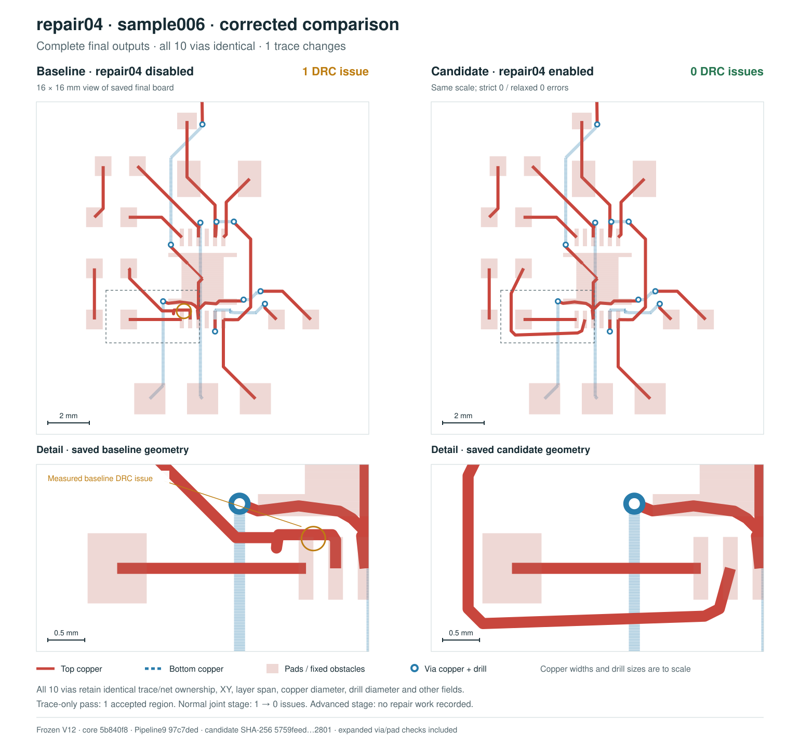

# repair04

> **Complete V12 benchmark:** the current SRJ33 revision improves from **0/15 to 5/15 passing boards (+33.33 percentage points)**; the complete older revision improves from **0/37 to 7/37 (+18.92 points)**. Both sides include dedicated via-in-pad and via-to-pad clearance checks. Four candidate timeouts remain in the denominators. A relative percentage increase is undefined from a zero-pass baseline. The original totals from the incomplete checker are withdrawn.

A bounded, incremental DRC repair solver for routed Simple Route JSON. By default it searches for same-layer clearance paths, adjusts bends, replaces short polyline spans, and adds doglegs while preserving every existing via, region boundary, terminal, and required electrical junction. Callers can separately permit selected existing vias to move with `movableVias`, or enable local layer bridges with `allowLayerChanges: true`. New or moved vias must clear pads even on the same net.

```sh
bun add github:tscircuit/repair04
```

```ts
import {
  extractRepairRegion,
  mergeRepairRegion,
  Repair04Solver,
} from "@tscircuit/repair04"

const region = extractRepairRegion({
  srj,
  routes,
  bounds: { minX: -5, minY: -5, maxX: 5, maxY: 5 },
})
const { bounds, boundaryMargin, lockedPointIndices } = region
const solver = new Repair04Solver({
  srj: region.srj,
  routes: region.routes,
  bounds,
  boundaryMargin,
  lockedPointIndices,
  maxCandidates: 8000,
})
solver.solve()
const candidate = mergeRepairRegion({
  routes,
  region,
  repairedRoutes: solver.getOutput(),
})
// Accept candidate only after evaluating it with the caller's full-board DRC.
```

## Region contract

- Bounds must be finite and at least 10 × 10 mm. The caller can choose larger bounds around difficult defects.
- Extraction clips traversing traces at exact intersections and loads a fixed clearance halo. The collar grows with copper dimensions and required clearances.
- Original endpoints, port points, tee contacts, shared vias, boundary segments, and atomic through-obstacle spans are fixed. The merge validates both geometry and metadata and rejects stale source state.
- Fixed preloaded copper, relevant pads and keepouts, and local board edges remain in the regional context. Unrelated geometry and embedded full-board state are excluded.
- `Repair04Solver` takes only the serializable local problem. The caller retains source provenance and the enclosing board. Use extraction to provide fixed cut points where traces cross the mutable boundary.
- Structured cloning and JSON transport of the local problem are supported. Metadata comparisons treat omitted and `undefined` object members alike; defined values, `null`, and array contents remain distinct. Keep source provenance with the caller and use JSON-compatible metadata when transporting through JSON.
- New bends retain copper width. Existing vias keep their exact positions, layer transitions, and diameters by default. Explicitly permitted vias move as complete layer transitions, and new/moved vias must clear every pad. Variable-width spans are not simplified into narrower copper.
- Marked `through_obstacle` transitions remain fixed atomic copper, whether their attachment points are colocated or separated. They are not physical vias and do not consume physical-via ordinals or authorize via movement.

A step evaluates at most one candidate. `maxCandidates` gives a deterministic search budget. Clearance paths use a bounded 0.1 mm grid, refined to half the copper width for traces at most 0.1 mm wide, with at most 30,000 expanded states per path. `solved` means that the optimization finished; unresolved DRC is reported by `stats.finalErrorCount`. Invalid geometry throws. `getOutput()` is available only after a completed solve and returns a copy.

The optional geometry permissions and search order are separate:

- `movableVias: [{ routeIndex, viaIndex }]` permits only the listed existing local vias to move in XY, even when `allowLayerChanges` is false. `routeIndex` refers to the cropped input routes; `viaIndex` is the physical via ordinal returned by `getRepairViaGeometry(route, layerCount)`. Selected vias must be unlocked. A nonempty list preserves every via's count, owner, layer sequence, and diameter and fixes all unselected positions, including when `allowLayerChanges` is true. Adding, removing, or merging vias is forbidden in this mode.
- `allowLayerChanges: true` enables local bridges and general via movement when no nonempty `movableVias` constraint is supplied. Bridges use the route's existing via diameter. The default is false.
- `traceOnlyFirst` defaults to true. With layer changes permitted, false skips the preliminary planar search, for callers that already ran a planar pass. It never grants permission to add or move a via. When layer changes are disabled, the path search stays on the same layer regardless of this flag; selected existing-via relocation remains controlled separately by `movableVias`.

The local score combines repair03's indexed copper checks with generic and rotated obstacle checks. In unrestricted layer-change mode it also includes pad-clearance violations for every unlocked existing via, including vias on their own net; this prevents a false zero-error early exit. Selected-via mode scores the explicit selection instead, and the default trace-only mode keeps every existing via fixed. Wire vertices on both sides of each via are explicit, so neither via-adjacent trace segment disappears from the score. A caller must still validate the merged board with its independent DRC implementation. Pipeline9 performs that check before accepting a region.

The V12 sample006 comparison uses freshly measured complete final Pipeline9 outputs: the disabled baseline has **1 DRC issue**, and the enabled candidate has **0** under both default and relaxed checks, including via-in-pad and via-to-pad checks. All **10 vias are exactly identical** between final outputs, including trace/net ownership, positions, layer spans, copper diameters, and drill diameters; only one trace changes geometry. The trace-only bounded pass accepts one region, the normal downstream joint stage resolves the remaining issue, and the advanced pass skips the clean input. This is a one-board example, not a dataset improvement claim.



The [measurements and exact via identities](docs/repair04-v12-srj33-sample006-corrected-metrics.json) and [independent saved-output audit](docs/sample006-two-pass-v12-audit.json) bind the fresh baseline, candidate and conversion context. The overview shows a 16 × 16 mm viewing window, with enlarged detail of the trace rerouted below the pad row. The figure identifies frozen core `5b840f89af83a19f74e9d03e6eed8b8cac4487d3` and Pipeline9 `97c7ded4754e976d3ad0d94c52630a81b268984a`; it is not a reused prototype result.

## Development

Bootstrapped using [the handbook guide](https://github.com/tscircuit/handbook/blob/main/guides/bootstrapping-repos.md), actual `@tscircuit/plop` templates, and [create-repo PR #70](https://github.com/tscircuit/create-repo/pull/70).

The preferred source-package layout exposes `lib/index.ts` and distributes `lib`. Bun lockfiles are disabled. Repair03 is pinned to a Git commit; no npm publishing or package build is required.

```sh
bun install
bun run typecheck
bun test
bun run format:check
bun start
bun run build:site
```

The Cosmos debugger has a near-crossing fixture that extracts a 10 mm square from a larger board and displays each solver step through `GenericSolverDebugger`. It shows physical copper widths, layers, obstacles, vias, and fixed anchors. On hosts with exhausted native file watchers, run `CHOKIDAR_USEPOLLING=true bun start`.

## Benchmarking

Use identical inputs, pipeline revision, dependency versions, and DRC checks for before/after comparisons. A passing board must complete the entire pipeline with zero DRC errors; regional improvements alone do not count. Report routing failures and timeouts in the full dataset denominator.

The Pipeline9 integration includes full-run and checkpoint replay scripts. Replays must first reproduce the disabled-repair04 baseline, including geometry and metadata. Reports identify the exact dataset revision, sample membership, input hashes, solver revision, and checker. A zero-pass baseline has no defined relative percentage increase: report the number of newly passing boards and the percentage-point gain instead.

The integration and complete benchmark report are tracked in [tscircuit-autorouter PR #2420](https://github.com/tscircuit/tscircuit-autorouter/pull/2420).

The complete V12 run includes all 15 inputs in published SRJ33 revision `026a78cb005ab33dde24f2db8fefbfd8d8efa614`, and all 37 inputs in older revision `f566b62be0f83395d9ab63ddc068f9d645b68b16`. Both default and relaxed DRC, including dedicated via-in-pad and via-to-pad clearance checks, improve from **0/15 to 5/15 (+33.33 percentage points)** on the current revision and **0/37 to 7/37 (+18.92 points)** on the older revision. Current passing boards are sample006, sample048, sample049, sample050 and sample056; sample001 and sample032 also pass in the older revision.

The fresh full baseline completes all 37 boards. The candidate completes 33/37, including 11/15 current boards; sample003, sample045, sample053 and sample055 reach their 30-minute candidate limits and remain failed boards in both applicable denominators. All 37 disabled replay gates match their fresh full-baseline outputs byte for byte. The current result reaches a 30-percentage-point interpretation of the requested improvement. A relative percentage increase from zero passing boards is undefined.

The original passing totals used incomplete via-pad coverage and are withdrawn. Historical corrected runs remain separately versioned and contribute no V12 candidate results. The fresh full baseline uses the same frozen routing implementation and dependency versions as the candidate, with both repair04 passes and their joint acceptance guard disabled.

Frozen V12 uses core `5b840f89af83a19f74e9d03e6eed8b8cac4487d3` and autorouter `97c7ded4754e976d3ad0d94c52630a81b268984a`. It includes the existing unlocked via-pad scoring correction, preserves marked through-obstacle transitions as atomic copper, and supports omitted optional object fields during JSON transport. Both sides include the same upstream fixes. The full baseline and each replay child have separate 30-minute solve limits; timeouts remain failed boards in the denominator. Candidate checkpoint replay measures the real remaining pipeline stages rather than full end-to-end routing time.

The frozen core passes 48 tests with 481 assertions, TypeScript and formatting. The focused Pipeline9 and DRC coverage suites pass 18 tests with 141 assertions. The complete frozen router Bun Test workflow passes all nine jobs: 660 tests pass, 63 are skipped and none fail, with 5,332 assertions. Its actual checkout is merge commit `904764687fd1fcce04fd36f28e27237735992eea`; that commit's tree exactly matches frozen router `97c7ded4754e976d3ad0d94c52630a81b268984a`. These facts identify the tested source, not an untested later documentation commit.

The separate full bugreport94 regression test preserves its five assertions and contributes no additional benchmark entry. Linux CI passes the correctness checks and compares the expected SVG in 456.23 seconds. The macOS run passes four correctness assertions and records the snapshot in update mode in 316.33 seconds; the resulting SVG was independently reviewed. The test requires at most five default DRC errors, not zero expanded errors. CI owns the 1,200-second test limit; neither run establishes performance within the old 300-second budget.

The [versioned V12 benchmark report and saved-output verification](https://github.com/tscircuit/tscircuit-autorouter/blob/codex/repair04-bounded-drc/docs/benchmarks/repair04/repair04-v12-srj33-report.md) record complete results and provenance. The immutable source manifest SHA-256 is `14e6bf2360954970faa29d4ae4f165e453bd1554a9b441cb86a9f80ae30cf166`; the sample006 audit binds this manifest and the exact output bytes.
